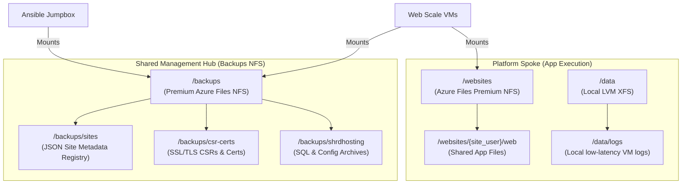

# 🚀 Deployment Guide
## End-to-End Environment Provisioning & Hardening

This guide covers the step-by-step deployment of the hardened architecture, from initial Azure setup to final configuration.

---

## 🛠️ Step 0: Preparation

### 0.1 Azure Authentication
Ensure you are logged in and have the correct subscription set:
```bash
az login
az account set --subscription "YOUR_SUBSCRIPTION_ID"
```

### 0.2 Project Branding & State Setup
Choose a project prefix (e.g., `myhosting new`) to brand your Azure resources:
```bash
export PROJECT_NAME="myhosting new"
```

To prevent global naming conflicts on Azure (since Storage Account names must be globally unique) and ensure absolute compatibility with resource naming rules, we automatically sanitize and persist your configuration.

Run the setup command to initialize your configuration:
```bash
make setup
```
This will automatically:
1. Strip all non-alphanumeric characters and spaces from your project name (e.g., `myhosting new` becomes `myhostingnew`).
2. Generate a unique backend storage account name (e.g., `stmyhostingnew1a2b3c`).
3. Save both the cleaned `PROJECT_NAME` and `TF_STATE_STORAGE` to your local `.env` file.

The `Makefile` and Terraform will automatically load these variables from `.env` in all future runs, ensuring you never have to export `PROJECT_NAME` again!

---

### 0.3 Customizing Your Deployment Blueprint
Before running any Terraform deployment steps, customize the infrastructure scale, network bounds, and database by editing [infra/terraform/platform/environments/main.tfvars](infra/terraform/platform/environments/main.tfvars) (cost-optimized defaults).

Key parameters you can tune in this file before deployment:
* `my_ip`: Change this from `*` to your office or home public IP range (e.g. `198.51.100.42/32`) to lock down administrative port access at the network firewall.
* `vnet_address_space`: Set the Spoke VNet subnet prefix to avoid overlaps with your corporate or existing cloud networks.
* `vm_count` & `vm_size`: Sizing and quantity of compute web VM nodes.
* `mysql_sku` & `mysql_storage_gb`: Performance tier and storage size for the MySQL database.
* `website_storage_gb`: Size of the shared website NFS share (Premium file shares have a 100 GB minimum).

> [!TIP]
> Need higher-throughput storage (Azure NetApp Files) or a preprod/prod split for staged rollouts? See the [`advanced` branch](https://github.com/chinmaymjog/azure-vm-hosting-solution/tree/advanced) - same platform, both of those included.

---

### 0.4 Zero-Trust Preparation
You no longer need to generate SSH keys manually. The platform now automatically generates a secure key pair and vaults it in Azure during the Hub deployment.

---

---

## 📦 Step 1: Bootstrap State Storage (Once)
Terraform needs a secure place to store its state before it can begin.

```bash
make bootstrap
```
This will securely execute the Azure CLI commands in the background using your unique project prefix, creating the resource group, storage account, and state blob container.

---

## 🏗️ Step 2: Infrastructure Deployment (Terraform)

### 2.1 Shared Management & Backup Hub
The Hub contains the Jumpbox, the management network, and the Shared Backup Share. It persists across environment cycles.

1. **Initialize and link to your state storage:**
```bash
make hub-init
```

2. **Deploy the Shared Hub:**
This step creates your management network, the Ansible Jumpbox, your backup storage, and **generates your secure SSH keys**.

```bash
make hub-deploy
```

**⚠️ IMPORTANT: Download your Private Key**
After the hub is deployed, you must download the generated private key from the Key Vault to access your VMs:
```bash
# Replace <VAULT_NAME> with the one shown in your hub-deploy output (e.g. kv-shrdhosting-...)
az keyvault secret download --name ssh-private-key --vault-name <VAULT_NAME> --file ssh-key
chmod 600 ssh-key
```
*Note: The output will provide the `ssh_command_jumpbox`.*

### 2.2 Platform Spoke
Deploy the Spoke network, load balancer, MySQL database, and website storage:
```bash
# Initialize the platform layer
make infra-init

# Deploy
make infra-deploy
```

Scaling later is a matter of editing `main.tfvars` (`vm_count`, `vm_size`, `mysql_sku`, ...) and re-running `make infra-deploy`. For a general-purpose SKU fleet, longer MySQL backup retention, and Azure NetApp Files, see the `advanced` branch instead of hand-tuning `main`.

---

## 🚀 Phase 3: Jenkins Automation & Platform Configuration
Now that the "Hardware" is ready, we use a containerized Jenkins Management Portal to drive our Ansible configurations securely.

### 3.1 Sync & Spin Up Jenkins
1. **Sync Automation Stack**: Push your Jenkins configuration and Ansible playbooks to the Jumpbox. This automatically generates a dynamic inventory of your deployed web VMs.
    ```bash
    make jenkins-sync
    ```
2. **Spin Up Jenkins**: Securely pass your private SSH key in-memory and start the Jenkins portal on the Jumpbox.
    ```bash
    make jenkins-up
    ```

### 3.2 Access the Hosting Management Portal
To securely access the Jenkins portal without exposing port 8080 to the public internet, use SSH Port Forwarding:
```bash
# Get the Jumpbox IP from terraform output in the shared-hub directory
ssh -L 8080:localhost:8080 -i ./ssh-key azureuser@<JUMPBOX_IP>
```
1. Open your browser and navigate to `http://localhost:8080`
2. **Username:** `admin`
3. **Password:** Value of your local `JENKINS_ADMIN_PASSWORD` environment variable.

### 3.3 Configure & Onboard Sites via UI
You no longer need to run raw Ansible commands! Inside Jenkins:
- Navigate to the **Hosting Management Portal** folder.
- Run the **Setup Web Stack** job to install Apache and PHP across your environments using the dynamic dropdowns.
- Run the **Onboard Site** job to automatically provision databases, users, VHosts, and website directories via a simple UI!

### 3.4 Deploy Your Code
Once onboarded, deploy your code directly to the shared website volume:
```bash
# Example: Deploying a static/PHP app
scp -i ./ssh-key -r ./my-code/* azureuser@<VM_IP>:/websites/<SITE_NAME>/public/
```

### 3.5 Test Your Site
Since we haven't configured public DNS yet, you can test your site by adding an entry to your local machine's hosts file:
1. **Get the Load Balancer Public IP**.
2. **Add to `/etc/hosts` (macOS/Linux)**:
    ```bash
    <PUBLIC_IP>  mysite.local
    ```
3. **Visit**: `http://mysite.local` in your browser.

---

## ⚙️ Environment Configuration & Dynamic Inventory

The automation plane separates dynamic, high-churn network data from stable, static infrastructure registries.

### 📡 Dynamic Inventory (`hosts`)
* **Purpose:** Maps Ansible hosts to target VM private IPs.
* **Operational Cycle:** **Dynamic & High-Churn**. VM IPs can shift during autoscaling, resizing, or spoke updates.
* **How it is populated:** Handled entirely by the platform automation. Running `make jenkins-sync` automatically queries the spoke state via Terraform (`terraform output -json vm_private_ips`), groups the results under `[preproduction]`, and dynamically compiles `infra/ansible/hosts`.

### 📂 Database Configuration Map (`database_vars.yml`)
* **Purpose:** Maps playbooks to target database nodes, administrative users, and Azure Key Vault secrets.
* **Operational Cycle:** **Static & Stable**. The SQL servers and Key Vault are persistent, stable architectural backbones.
* **How it is populated:**
  1. **Deploy Hub:** Run `make hub-deploy`, which outputs the globally unique Key Vault name (e.g., `kv-myhostingnew-5e12c6a8`).
  2. **Deploy Spoke:** Run `make infra-deploy`, which deploys the MySQL server and outputs its stable FQDN.
  3. **Bootstrap Mapping:** Copy these stable FQDNs and the Key Vault name into `infra/ansible/playbooks/var_files/database_vars.yml` once during the initial bootstrapping of your environment.
  4. **Zero-Trust Security:** Absolutely no passwords or secrets are written here. Playbooks dynamically query Key Vault at runtime using the host's System-Assigned Managed Identity.

---

## 💾 Storage Layout & NFS Architecture

The hosting platform implements a storage layout built on segregated NFS volumes to cleanly separate application code execution from platform management state and backup archives.



### 1. `/websites` — Azure Files Premium NFS
* **Role:** Shared application execution workspace.
* **Technology:** A dedicated Azure Files Premium storage account/share mounted via NFSv4.1. (The `advanced` branch swaps this for Azure NetApp Files, for sub-millisecond latency at higher cost.)
* **Usage:** Hosts active application document roots (`/websites/{{ site_user }}/web`) and dynamic server logs.
* **Security:** Secured using dynamic POSIX permissions (`owner: site_user`, `group: web_users`) and a private endpoint restricted to the platform spoke's compute subnet.

### 2. `/backups` — Premium Azure Files NFS
* **Role:** Hardened, centralized management registry and backup vault.
* **Technology:** Premium Azure Files NFS v4.1 share hosted globally inside the Shared Management Hub.
* **Security:** Strictly isolated by an Azure Storage Firewall and private network endpoints, accessible only to authorized compute instances and the Ansible Jumpbox.
* **Structure:**
  * `/backups/sites/`: The decentralized JSON metadata registry. Every site creation (`php_site_add.yml` / `html_site_add.yml`) writes a persistent `<domain>.json` record here. All operations query this directory to discover site owners, PHP versions, database users, and HTTP authentication properties, completely deprecating legacy VM-level text indexes.
  * `/backups/csr-certs/`: Stores public/private certificate signing requests (CSRs) and issued certificates.
  * `/backups/shrdhosting/main/`: Backups for the deployed environment, holding database dumps (`database_backup/`) and configuration archives (`apache_conf_backup/`, `site_config_backup/`).

### 3. `/data` — Local LVM Storage
* **Role:** VM-local execution layer.
* **Technology:** High-speed local SSD managed through Logical Volume Manager (LVM) and formatted with XFS.
* **Usage:** Dedicated to local caching, low-latency system-level logging, and dynamic runtime temp files, ensuring no local VM disk holds persistent platform state.

## 🔐 Secret Management & Access
The platform uses **Azure Key Vault** to manage all sensitive information.
- **Passwords**: Generated randomly during `make hub-deploy`.
- **SSH Keys**: The private key is generated by Terraform and stored in the Vault. For operator access, download it locally as `ssh-key` and keep it out of source control.
- **Retrieval**: To log in, you must download the private key from your Vault:
    ```bash
    # Get your Vault Name from the hub-deploy output
    az keyvault secret download --name ssh-private-key --vault-name <VAULT_NAME> --file ssh-key-new
    chmod 600 ssh-key-new
    ```
- **Access**: Only authorized users and service principals can read secrets. You can view the generated DB password in the Azure Portal under the `kv-shrdhosting-...` resource.

> [!IMPORTANT]
> **Vault Firewall**: The Key Vault is hardened with a network firewall. Your current public IP is automatically whitelisted during `make hub-deploy`. If your IP changes, you will need to re-run the command to regain access.

## 🛡️ Verification Checklist
- [ ] **Connectivity**: Access site via `frontdoor_url`.
- [ ] **Secrets**: Verify the Database was created using the secret from Key Vault.
- [ ] **Hardening**: Check `/var/log/provisioner.log` on any VM.
- [ ] **Storage**: Verify `/backups` mount on Jumpbox and Web VMs.
