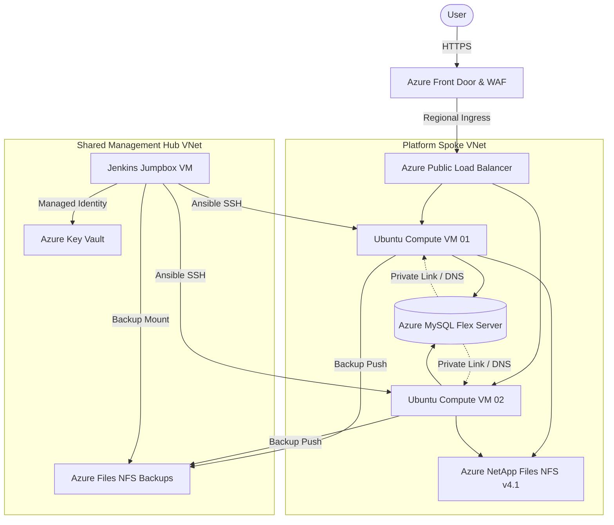

# ☁️ Azure Shared Hosting Platform
## Hardened Multi-Tenant Infrastructure on Azure

A modular, enterprise-grade Infrastructure-as-Code (IaC) repository for deploying a secure, high-performance shared hosting platform on Azure using a Hub-Spoke architecture, centralized Jumpbox management, and zero-trust credentials.

> [!TIP]
> This project deploys a hardened, zero-trust shared hosting infrastructure mimicking production enterprise hosting standards.

## 🏗️ Architecture: The "Hub-Spoke & Private DNS" Design

Like your other sandboxes, this project segregates public traffic, management planes, and database persistence. The runtime environment relies on private spokes peered with a management hub.



## 🚀 Overview

This lab provides an automated, VM-based hosting environment built with a platform engineering approach. It automates compute cluster scaling via Terraform, installs Apache/PHP runtimes via Ansible, and drives site creation pipelines through a hardened Jenkins management portal.

## System Docs (Engineering Workflow)

- Project specification: [docs/project-spec.md](file:///Users/chinmayjog/repos/personal/azure-vm-hosting-solution/docs/project-spec.md)
- Architecture decisions: [docs/architecture.md](file:///Users/chinmayjog/repos/personal/azure-vm-hosting-solution/docs/architecture.md)
- Execution tracker: [docs/tasks.md](file:///Users/chinmayjog/repos/personal/azure-vm-hosting-solution/docs/tasks.md)

---

## 📋 Prerequisites

### System Requirements
*   **Operating System**: macOS or Linux.
*   **Azure Subscription**: Active account with sufficient quotas.
*   **Tools**: Azure CLI (`az`), Terraform >= 1.5.0, Make.

Install example (macOS):
```bash
brew install azure-cli terraform
az login
```

---

## 🏗️ Stack Catalog

The hosting environment is organized into modular infrastructure blocks:

| Category | Tools | Description |
| :--- | :--- | :--- |
| **Global Ingress** | Azure Front Door & WAF | Edge caching, SSL offloading, and threat protection |
| **Load Balancing** | Azure Load Balancer | Distributes inbound traffic to compute fleet spokes |
| **Compute Engine** | Hardened Ubuntu VMs | Scalable fleet running Apache 2.4 + PHP-FPM (8.1/8.2) |
| **Shared Storage** | Azure NetApp Files | Sub-millisecond NFS v4.1 storage for live web applications |
| **Backup Storage** | Premium Azure Files NFS | Segmented backups path mounted globally in the Hub |
| **Database** | Azure MySQL Flexible Server | Persistent, private database engine isolated via Private DNS |
| **Secrets Engine** | Azure Key Vault | Zero-knowledge secret and SSH key vaults |
| **CI/CD & Portal** | Jenkins (Dockerized) | Web-based management portal running on the Jumpbox VM |

---

## 🛠️ Quick Start

### 1. Initialize Environment
Choose a unique project prefix (e.g. `shrdhosting`) to prevent naming conflicts on Azure:
```bash
export PROJECT_NAME="shrdhosting"
```

Bootstrap your local variables:
```bash
make setup
```
This sanitizes the project prefix and saves it to a local `.env` file along with storage settings.

### 2. Bootstrap Remote State
Create the resource group, storage account, and container for Terraform state tracking:
```bash
make bootstrap
```

### 3. Deploy Shared Hub
Deploy the core management network, Key Vault, backups storage, and Jumpbox VM:
```bash
make hub-init
make hub-deploy
```

### 4. Retrieve VM Private Key
The platform generates the SSH keys in Key Vault dynamically. Download the key locally to authenticate with your VMs:
```bash
# Retrieve the Key Vault name from the terraform output and run:
az keyvault secret download --name ssh-private-key --vault-name <VAULT_NAME> --file ssh-key
chmod 600 ssh-key
```

### 5. Deploy Platform Spokes
Select your environment workspace (e.g., `preprod`, `prod`) and provision the Spoke network, load balancer, MySQL database, and NetApp files volume:
```bash
make infra-init
make infra-preprod
```

### 6. Sync and Spin Up Jenkins Portal
Synchronize your playbooks and spin up the Dockerized Jenkins server on the Jumpbox:
```bash
make jenkins-sync
make jenkins-up
```

### 7. Access the Hosting Portal
Use SSH port forwarding to access the hardened Jenkins portal securely:
```bash
# Get JUMPBOX_IP from terraform output in shared-hub
ssh -L 8080:localhost:8080 -i ./ssh-key azureuser@<JUMPBOX_IP>
```
Open your browser and log in at **`http://localhost:8080`** using:
* **Username**: `admin`
* **Password**: `SecureAdminPassword2026!`

---

## 🔌 Operational Onboarding (Daily Operations)

### Onboarding a New Site
You can onboard new shared hosting sites using the portal or via raw Ansible CLI.

#### Method A: Using Jenkins (Recommended)
1. Go to the **Hosting Management Portal** folder on Jenkins dashboard.
2. Select the **`site_add`** Job.
3. Click **Build with Parameters** and input:
   * `site_url`: The domain of the site (e.g., `mytestsite.com`).
   * `php_version`: Target PHP runtime (e.g., `php8.1` or `php8.2`).
4. Click **Build**.

#### Method B: Manual CLI Run (Ansible)
Run directly from the Jumpbox VM terminal:
```bash
ansible-playbook -i /etc/ansible/hosts /etc/ansible/playbooks/php_site_add.yml \
  --extra-vars "site_url=mytestsite.com php_version=php8.1"
```

### Site Verification & Routing
Test your new sites instantly using the following methods:

#### 1. Command Line Verification (cURL Host Override)
Send a request directly to the Public Load Balancer IP while overriding the HTTP Host header:
```bash
curl -i -H "Host: mytestsite.com" http://<LOAD_BALANCER_PUBLIC_IP>
```

#### 2. Browser Verification (Local Hosts Override)
Add a local DNS map in your `/etc/hosts` file:
```text
<LOAD_BALANCER_PUBLIC_IP>  mytestsite.com
```
Then visit **`http://mytestsite.com`** in your browser.

#### 3. Production Deployment (Azure Front Door Ingress)
To publish the custom domain, update your Front Door configuration in [frontdoor.tf](file:///Users/chinmayjog/repos/personal/azure-vm-hosting-solution/infra/terraform/platform/frontdoor.tf):
```terraform
resource "azurerm_cdn_frontdoor_custom_domain" "site_domain" {
  name                     = "mytestsite-domain"
  cdn_frontdoor_profile_id = azurerm_cdn_frontdoor_profile.afd.id
  host_name                = "mytestsite.com"
  
  tls {
    certificate_type    = "ManagedCertificate"
    minimum_tls_version = "TLS12"
  }
}
```
Apply the changes:
```bash
cd infra/terraform/platform && terraform apply -var-file="environments/preprod.tfvars" -auto-approve
```

---

## 🧰 Helpful Commands

```bash
make setup          # Configure local environment prefix
make bootstrap      # Deploy Azure state storage backend
make hub-deploy     # Deploy Shared Hub management plane
make infra-preprod  # Deploy preprod spoke environment
make jenkins-sync   # Sync playbooks and update dynamic inventory
make jenkins-up     # Spin up Jenkins container on the Jumpbox VM
make clean          # Display cleanup instructions
```

---
*Maintained by [Chinmay Jog](https://github.com/chinmaymjog) | 📖 [Read my articles on Medium](https://medium.com/@chinmaymjog)*
